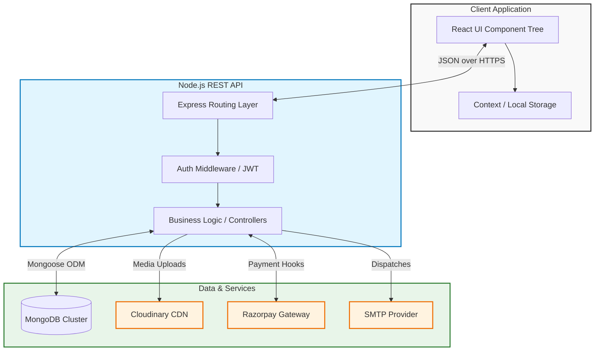

<div align="center">
  

  # 🌿 BARESKIN

  **Premium Skincare E-Commerce & Management Platform**

  [](#)
  [](#)
  [](#)
  [](#)
  [](#)
  [](#)

  <p align="center">
    A state-of-the-art full-stack web application delivering an unparalleled, mobile-first shopping experience alongside a robust, enterprise-grade administrative dashboard.
  </p>
</div>

<details>
  <summary><strong>Table of Contents</strong> (Click to expand)</summary>

- [About The Project](#-about-the-project)
- [Key Features](#-key-features)
- [Tech Stack](#-tech-stack)
- [Architecture Diagram](#-architecture-diagram)
- [CI/CD Pipeline](#-cicd-pipeline)
- [Getting Started](#-getting-started)
  - [Prerequisites](#prerequisites)
  - [Installation](#installation)
  - [Environment Variables](#environment-variables)
- [Project Structure](#-project-structure)
- [Usage](#-usage)
- [Contributing](#-contributing)
- [License](#-license)
- [Contact](#-contact)
</details>

---

## 📖 About The Project

**BARESKIN** is a comprehensive, production-ready e-commerce solution tailored specifically for the luxury skincare industry. Built with a focus on high performance, secure transactions, and a polished user interface, the platform serves two distinct user groups seamlessly:

1. **Customers**: Providing a high-end, responsive, and intuitive interface to discover products, analyze ingredients, manage subscriptions, and process payments securely.
2. **Administrators**: Offering a powerful, real-time analytics dashboard to manage inventory, process orders, track revenue, and orchestrate promotional campaigns.

---

## ✨ Key Features

### 🛍️ Client Experience
* **Mobile-First Paradigm**: Designed with mobile and tablet specific layouts, bottom navigation, and touch-optimized interfaces.
* **Interactive Skin Lab**: An algorithmic "Skin Quiz" to recommend personalized routines and analyze complex skincare ingredients.
* **Secure Payment Gateway**: Fully integrated with **Razorpay** for seamless, encrypted transactions.
* **Authentication Matrix**: Secure JWT-based email/password authentication backed by Google OAuth 2.0 integration.
* **Dynamic Wishlists & Carts**: Real-time state management preserving user sessions and preferences.

### 🛡️ Administrative Control
* **Analytics Dashboard**: Real-time business intelligence visualizing sales, user acquisition, and traffic using *Recharts*.
* **Inventory & Order Management**: Comprehensive CRUD capabilities for product catalogs and dynamic order status tracking.
* **Campaign Management**: Generate, track, and expire promotional codes and marketing banners dynamically.
* **User Management**: Granular control over user roles, permissions, and platform activity.

---

## 💻 Tech Stack

### Frontend Architecture
* **Core**: React 19, Vite 8, React Router DOM v7
* **Styling**: Tailwind CSS v4.2, Framer Motion (Micro-animations)
* **Data Management**: Axios, React Context API
* **Utilities**: React Hot Toast (Notifications), React Helmet Async (SEO), Lucide React (Iconography)

### Backend Architecture
* **Core**: Node.js, Express.js 5.2
* **Database**: MongoDB (Mongoose 9.4)
* **Security**: JWT (JSON Web Tokens), Bcrypt.js, Helmet, CORS
* **Services**: 
  * Cloudinary (Media CDN)
  * Nodemailer (SMTP Transactional Emails)
  * Node-Cron (Background scheduling & task automation)

---

## 🏗️ Architecture Diagram

The application leverages a decoupled microservices-inspired architecture, separating the client from the core API layer.



---

## 🚀 CI/CD Pipeline

The deployment strategy ensures rapid, zero-downtime updates from the central repository to production environments.

```mermaid
flowchart LR
    %% Styles
    classDef process fill:#fff,stroke:#333,stroke-width:2px;
    classDef deploy fill:#222,stroke:#fff,stroke-width:2px,color:#fff;
    classDef fail fill:#ffebee,stroke:#c62828,stroke-width:2px;

    %% Workflow
    Dev((Developer)) -->|Push / Merge| Git[GitHub Repository]
    Git --> Actions{GitHub Actions}
    
    Actions -->|Job 1| Lint[ESLint & Prettier Check]
    Actions -->|Job 2| Build[Vite Compile & Build]
    
    Lint -- Fail --> Notify[Notify Slack/Email]
    Build -- Fail --> Notify
    
    Lint -- Pass --> Deploy
    Build -- Pass --> Deploy
    
    Deploy{Deployment Layer} -->|Static Assets| Vercel[Vercel (Frontend)]
    Deploy -->|Node Environment| Render[Render / AWS (Backend)]

    class Dev,Git,Actions,Lint,Build process;
    class Vercel,Render deploy;
    class Notify fail;
```

---

## 🚦 Getting Started

Follow these instructions to set up a local development environment.

### Prerequisites

Ensure you have the following installed on your local machine:
* [Node.js](https://nodejs.org/) (v18.x or higher recommended)
* [npm](https://www.npmjs.com/) (v9.x or higher)
* [Git](https://git-scm.com/)
* A MongoDB connection string (Local or MongoDB Atlas)

### Installation

1. **Clone the repository**
   ```bash
   git clone https://github.com/lokanathmeher19/BARESKIN.git
   cd BARESKIN
   ```

2. **Install Backend Dependencies**
   ```bash
   cd BACKEND_API
   npm install
   ```

3. **Install Frontend Dependencies**
   ```bash
   cd ../FRONTEND_CLIENT
   npm install
   ```

### Environment Variables

You must create `.env` files in both directories to securely store API keys and database credentials.

#### `BACKEND_API/.env`
```env
# Server Configuration
PORT=5000
MONGO_URI=your_mongodb_cluster_url
JWT_SECRET=your_secure_jwt_secret

# Third-Party API Keys
CLOUDINARY_CLOUD_NAME=your_cloud_name
CLOUDINARY_API_KEY=your_cloudinary_api_key
CLOUDINARY_API_SECRET=your_cloudinary_secret

RAZORPAY_KEY_ID=your_razorpay_key
RAZORPAY_KEY_SECRET=your_razorpay_secret

EMAIL_USER=your_smtp_email
EMAIL_PASS=your_smtp_password
```

#### `FRONTEND_CLIENT/.env`
```env
VITE_API_URL=http://localhost:5000/api
VITE_GOOGLE_CLIENT_ID=your_google_oauth_client_id
```

---

## 📂 Project Structure

```text
BARESKIN/
├── BACKEND_API/             # Core Backend Services
│   ├── controllers/         # Handles incoming HTTP requests
│   ├── middlewares/         # Route protection and request validation
│   ├── models/              # Mongoose data schemas (User, Product, Order)
│   ├── routes/              # Express endpoint definitions
│   ├── utils/               # Helper modules (cron jobs, email templates)
│   └── server.js            # Express application entry point
│
└── FRONTEND_CLIENT/         # React Application
    ├── public/              # Static assets (Favicons, manifest)
    ├── src/
    │   ├── admin/           # Administrative Panel components and views
    │   ├── assets/          # Images, svgs, and local media
    │   ├── components/      # Shared, reusable UI components
    │   ├── context/         # Global state management
    │   ├── mobile_tablet/   # Responsive overriding views for mobile
    │   ├── pages/           # Primary client-facing routing pages
    │   └── utils/           # Axios interceptors and custom hooks
    └── tailwind.config.js   # Global design system configuration
```

---

## ⚡ Usage

To run the application locally, you will need to boot both the server and the client.

**1. Start the Backend API (Terminal 1)**
```bash
cd BACKEND_API
npm run dev
```
*The server will start on `http://localhost:5000`*

**2. Start the Frontend Application (Terminal 2)**
```bash
cd FRONTEND_CLIENT
npm run dev
```
*The client will start on `http://localhost:5173`*

---

## 🤝 Contributing

Contributions are what make the open-source community such an amazing place to learn, inspire, and create. Any contributions you make are **greatly appreciated**.

1. Fork the Project
2. Create your Feature Branch (`git checkout -b feature/AmazingFeature`)
3. Commit your Changes (`git commit -m 'Add some AmazingFeature'`)
4. Push to the Branch (`git push origin feature/AmazingFeature`)
5. Open a Pull Request

---

## 📜 License

Distributed under a proprietary license. All rights reserved. 
*(If this project is intended for Open Source, please update this section with an MIT or Apache 2.0 License)*.

---

## 📬 Contact

**Lokanath Meher**  
Project Link: [https://github.com/lokanathmeher19/BARESKIN](https://github.com/lokanathmeher19/BARESKIN)

<p align="center">
  Built with ❤️ by Lokanath Meher
</p>
