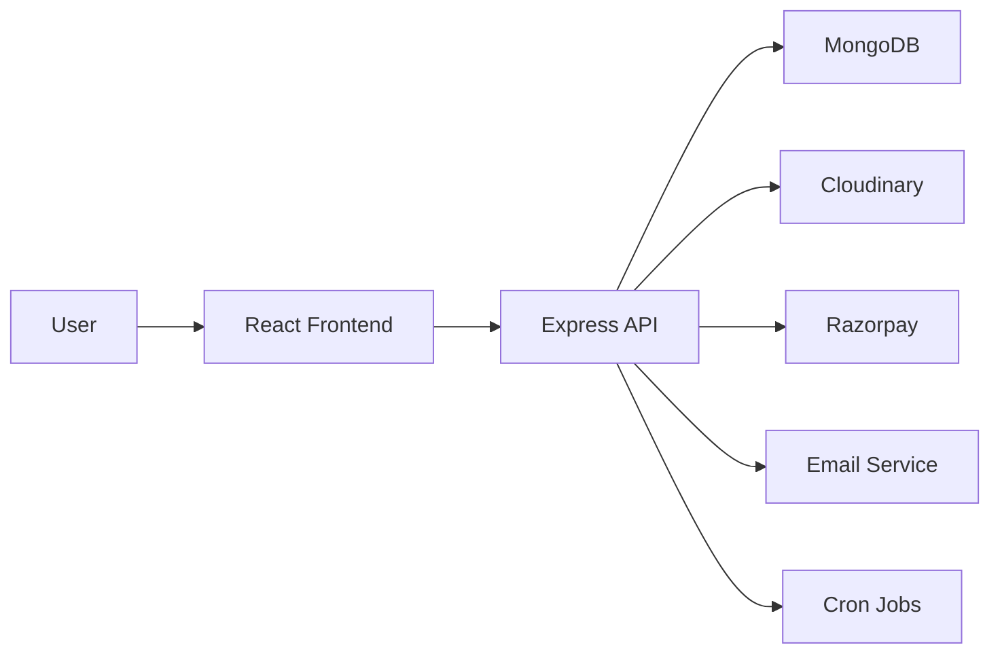

# BareSkin

BareSkin is a modern skincare e-commerce platform built with a React frontend and an Express.js backend. It offers a full shopping experience for skincare products, including product discovery, cart and checkout, user accounts, subscriptions, promotions, and an admin dashboard for store management.

## Overview

This project combines a polished storefront with a robust management layer for administrators. Users can browse products, view detailed information, add items to cart or wishlist, complete purchases, and access skincare-focused tools such as a skin quiz and ingredient analyzer. Admins can manage products, orders, users, subscriptions, banners, and promo codes.

## Tech Stack

### Frontend
- React 19
- Vite
- React Router DOM
- Framer Motion
- Tailwind CSS
- Recharts
- React Hot Toast

### Backend
- Node.js
- Express.js
- MongoDB with Mongoose
- JWT Authentication
- Google OAuth
- Razorpay payments
- Cloudinary media storage
- Nodemailer email support
- Node-cron scheduled jobs

## Project Pipeline



The application flow is:
1. Users interact with the Vite-based storefront.
2. The frontend sends requests to the Express API.
3. The backend processes authentication, products, cart, orders, payments, subscriptions, and promotions.
4. Data is stored in MongoDB and media is handled through Cloudinary.
5. Background jobs and email notifications support order and subscription workflows.

## Key Features

- User authentication and profile management
- Product listing and product detail pages
- Cart, checkout, and order history
- Wishlist and compare features
- Skin quiz and ingredient analyzer tools
- AR try-on experience
- Subscription management
- Promo code support
- Admin dashboard for store operations
- Banner and promotional content management

## Project Structure

```text
BARESKIN/
├── BACKEND_API/
│   ├── config/
│   ├── controllers/
│   ├── jobs/
│   ├── middleware/
│   ├── models/
│   ├── routes/
│   ├── utils/
│   └── server.js
├── FRONTEND_CLIENT/
│   ├── src/
│   │   ├── admin/
│   │   ├── components/
│   │   ├── context/
│   │   ├── pages/
│   │   └── utils/
│   └── package.json
└── package.json
```

## Prerequisites

Make sure the following tools are installed on your machine:
- Node.js 18+
- npm 9+
- MongoDB instance

## Installation

1. Clone the repository
   ```bash
   git clone https://github.com/lokanathmeher19/BARESKIN.git
   cd BARESKIN
   ```

2. Install dependencies for the whole workspace
   ```bash
   npm run install:all
   ```

3. Configure environment variables for the backend
   Create a file named `.env` inside the `BACKEND_API` folder and add the required values:

   ```env
   PORT=5000
   NODE_ENV=development
   MONGO_URI=your_mongodb_connection_string
   JWT_SECRET=your_jwt_secret
   CLIENT_URL=http://localhost:5173

   GOOGLE_CLIENT_ID=your_google_client_id

   RAZORPAY_KEY_ID=your_razorpay_key_id
   RAZORPAY_KEY_SECRET=your_razorpay_key_secret

   CLOUDINARY_CLOUD_NAME=your_cloudinary_cloud_name
   CLOUDINARY_API_KEY=your_cloudinary_api_key
   CLOUDINARY_API_SECRET=your_cloudinary_api_secret

   SMTP_HOST=your_smtp_host
   SMTP_PORT=your_smtp_port
   SMTP_EMAIL=your_smtp_email
   SMTP_PASSWORD=your_smtp_password
   FROM_NAME=BareSkin
   FROM_EMAIL=noreply@bareskin.com

   ADMIN_EMAIL=admin@example.com
   ADMIN_PASSWORD=admin12345
   ```

## Running the Project

### Start both frontend and backend together
```bash
npm run dev
```

### Start them separately
```bash
npm run server
npm run client
```

The app will generally be available at:
- Frontend: http://localhost:5173
- Backend API: http://localhost:5000

## Available Scripts

| Location | Command | Purpose |
| --- | --- | --- |
| Root | `npm run dev` | Start backend and frontend together |
| Root | `npm run server` | Start the Express server |
| Root | `npm run client` | Start the Vite frontend |
| Root | `npm run install:all` | Install dependencies for the workspace |
| Frontend | `npm run build` | Build the client for production |
| Frontend | `npm run lint` | Run ESLint checks |
| Backend | `npm run start` | Start the backend server |

## Deployment Notes

- Deploy the frontend to a static host such as Vercel or Netlify.
- Deploy the backend to a Node.js-compatible hosting provider such as Render, Railway, or VPS.
- Make sure environment variables are configured securely in the deployment platform.

## License

This project is licensed under the ISC license.
