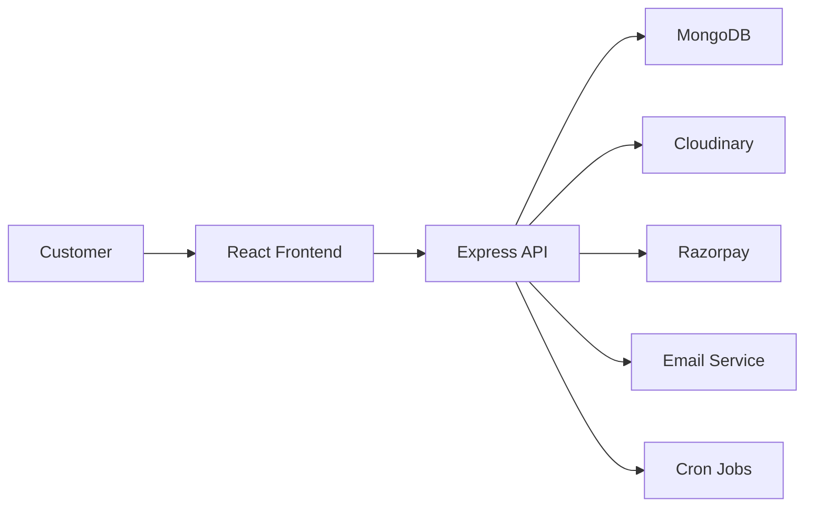

# BareSkin

BareSkin is a full-stack skincare commerce platform designed to deliver a seamless shopping experience for customers while providing a powerful administrative dashboard for business operations. Built with a modern React frontend and a scalable Express.js backend, the application supports product discovery, secure transactions, subscriptions, promotional campaigns, and content management.

## Overview

BareSkin brings together a polished customer-facing storefront and a robust internal management system. Customers can explore skincare products, view detailed product information, save favorites, manage their cart, complete purchases, and access intelligent skincare tools such as a skin quiz and an ingredient analyzer. Administrators can manage products, orders, users, subscriptions, banners, and promotional offers from a centralized dashboard.

## Technology Stack

### Frontend
- React 19
- Vite
- React Router DOM
- Framer Motion
- Tailwind CSS
- Recharts
- React Hot Toast

### Backend
- Node.js
- Express.js
- MongoDB with Mongoose
- JWT-based authentication
- Google OAuth integration
- Razorpay payment processing
- Cloudinary media management
- Nodemailer for transactional emails
- Node-cron for scheduled automation

## System Flow



The platform operates through the following flow:
1. Customers interact with the modern storefront interface.
2. The frontend communicates with the Express API for all core operations.
3. The backend handles authentication, product management, cart workflows, orders, payments, subscriptions, and promotions.
4. Product data and user information are stored in MongoDB.
5. Media assets, payment gateways, and scheduled automation complete the end-to-end experience.

## Core Features

- Secure user authentication and profile management
- Responsive product catalog with detailed product views
- Shopping cart, checkout, and order history
- Wishlist and product comparison tools
- Interactive skincare assessment tools, including a skin quiz and ingredient analyzer
- Augmented reality try-on experience
- Subscription-based purchasing workflows
- Promo code and campaign management
- Admin dashboard for store operations and content control
- Banner and promotional content administration

## Project Structure

```text
BARESKIN/
├── BACKEND_API/
│   ├── config/
│   ├── controllers/
│   ├── jobs/
│   ├── middleware/
│   ├── models/
│   ├── routes/
│   ├── utils/
│   └── server.js
├── FRONTEND_CLIENT/
│   ├── src/
│   │   ├── admin/
│   │   ├── components/
│   │   ├── context/
│   │   ├── pages/
│   │   └── utils/
│   └── package.json
└── package.json
```

## Prerequisites

Ensure the following tools are installed on your machine:
- Node.js 18 or later
- npm 9 or later
- A running MongoDB instance

## Installation

1. Clone the repository
   ```bash
   git clone https://github.com/lokanathmeher19/BARESKIN.git
   cd BARESKIN
   ```

2. Install dependencies for the full workspace
   ```bash
   npm run install:all
   ```

3. Configure environment variables for the backend
   Create a `.env` file inside the `BACKEND_API` directory and add the required configuration values:

   ```env
   PORT=5000
   NODE_ENV=development
   MONGO_URI=your_mongodb_connection_string
   JWT_SECRET=your_jwt_secret
   CLIENT_URL=http://localhost:5173

   GOOGLE_CLIENT_ID=your_google_client_id

   RAZORPAY_KEY_ID=your_razorpay_key_id
   RAZORPAY_KEY_SECRET=your_razorpay_key_secret

   CLOUDINARY_CLOUD_NAME=your_cloudinary_cloud_name
   CLOUDINARY_API_KEY=your_cloudinary_api_key
   CLOUDINARY_API_SECRET=your_cloudinary_api_secret

   SMTP_HOST=your_smtp_host
   SMTP_PORT=your_smtp_port
   SMTP_EMAIL=your_smtp_email
   SMTP_PASSWORD=your_smtp_password
   FROM_NAME=BareSkin
   FROM_EMAIL=noreply@bareskin.com

   ADMIN_EMAIL=admin@example.com
   ADMIN_PASSWORD=admin12345
   ```

## Running the Project

### Start both the frontend and backend together
```bash
npm run dev
```

### Start them separately
```bash
npm run server
npm run client
```

The application will be available at:
- Frontend: http://localhost:5173
- Backend API: http://localhost:5000

## Available Scripts

| Location | Command | Purpose |
| --- | --- | --- |
| Root | `npm run dev` | Start backend and frontend together |
| Root | `npm run server` | Start the Express server |
| Root | `npm run client` | Start the Vite frontend |
| Root | `npm run install:all` | Install dependencies for the workspace |
| Frontend | `npm run build` | Build the client for production |
| Frontend | `npm run lint` | Run ESLint checks |
| Backend | `npm run start` | Start the backend server |

## Deployment Notes

- Deploy the frontend to a static hosting platform such as Vercel or Netlify.
- Deploy the backend to a Node.js-compatible platform such as Render, Railway, or a VPS.
- Configure all required environment variables securely in the deployment environment.

## License

This project is licensed under the ISC license.
