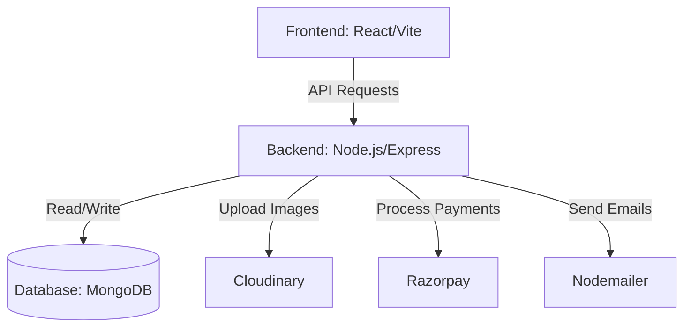
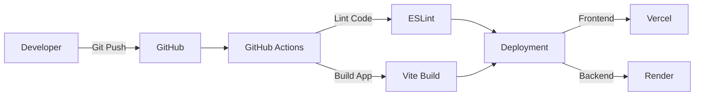

<div align="center">
  

  # 🌿 BARESKIN

  **A Full-Stack E-Commerce Web Application**

  [](#)
  [](#)
  [](#)
  [](#)
  [](#)

  <p align="center">
    A premium skincare e-commerce platform built using the MERN stack. Designed with a mobile-first approach, secure payments, and a complete admin dashboard.
  </p>
</div>

---

## 📖 About The Project

**BARESKIN** is my full-stack web development project built to showcase a complete e-commerce flow. It provides a smooth shopping experience for users and an easy-to-use admin panel for managing the store.

The goal of this project was to learn and implement:
- Complex state management in React.
- Secure user authentication (JWT & Google OAuth).
- RESTful API development using Node.js & Express.
- Payment gateway integration (Razorpay).
- Responsive, modern UI design using Tailwind CSS.

---

## ✨ Key Features

### 🛍️ User Features
* **Mobile-Friendly UI**: Optimized layouts and bottom navigation for mobile users.
* **Skin Quiz & Lab**: A feature to recommend personalized skincare routines.
* **Shopping Cart & Wishlist**: Add products to cart or save them for later.
* **Secure Checkout**: Integrated with **Razorpay** for testing secure payments.
* **Authentication**: Login with Email/Password or Google account.

### 🛡️ Admin Features
* **Dashboard Analytics**: View sales and user data using interactive charts (*Recharts*).
* **Manage Products**: Add, edit, or delete skincare products from the database.
* **Order Tracking**: Update and monitor the status of user orders.
* **User & Promo Management**: View registered users and manage discount codes.

---

## 💻 Tech Stack

- **Frontend**: React 19, Vite, Tailwind CSS 4, Framer Motion, React Router DOM, Axios
- **Backend**: Node.js, Express.js
- **Database**: MongoDB & Mongoose
- **Authentication**: JSON Web Tokens (JWT), Google Auth Library
- **Cloud Services**: Cloudinary (Image storage)
- **Payments**: Razorpay
- **Extras**: Nodemailer (Emails), Node-Cron (Scheduled tasks)

---

## 🏗️ Architecture Diagram

Here is a high-level overview of how the frontend, backend, and external services interact.



---

## 🚀 CI/CD Pipeline Flow

This diagram shows the workflow from writing code to deployment.



---

## 🚦 Getting Started

Follow these steps to run the project locally on your machine.

### Prerequisites
* Node.js installed
* A MongoDB database URI
* Cloudinary and Razorpay test API keys

### Installation

1. **Clone the repository**
   ```bash
   git clone https://github.com/lokanathmeher19/BARESKIN.git
   cd BARESKIN
   ```

2. **Setup Backend**
   ```bash
   cd BACKEND_API
   npm install
   ```
   Create a `.env` file in `BACKEND_API/`:
   ```env
   PORT=5000
   MONGO_URI=your_mongodb_url
   JWT_SECRET=your_jwt_secret
   CLOUDINARY_CLOUD_NAME=your_cloud_name
   CLOUDINARY_API_KEY=your_api_key
   CLOUDINARY_API_SECRET=your_api_secret
   RAZORPAY_KEY_ID=your_razorpay_key
   RAZORPAY_KEY_SECRET=your_razorpay_secret
   EMAIL_USER=your_email
   EMAIL_PASS=your_app_password
   ```
   Run backend: `npm run dev`

3. **Setup Frontend**
   Open a new terminal and run:
   ```bash
   cd FRONTEND_CLIENT
   npm install
   ```
   Create a `.env` file in `FRONTEND_CLIENT/`:
   ```env
   VITE_API_URL=http://localhost:5000/api
   VITE_GOOGLE_CLIENT_ID=your_google_client_id
   ```
   Run frontend: `npm run dev`

---

## 📂 Project Structure

```text
BARESKIN/
├── BACKEND_API/             # Node.js Server
│   ├── controllers/         # Logic for routes
│   ├── models/              # MongoDB schemas
│   ├── routes/              # API endpoints
│   ├── utils/               # Helper functions
│   └── server.js            # Entry point
│
└── FRONTEND_CLIENT/         # React Frontend
    ├── src/
    │   ├── admin/           # Admin dashboard pages
    │   ├── components/      # Reusable UI parts
    │   ├── context/         # React Context (State)
    │   ├── pages/           # Main website pages
    │   └── App.jsx          # Main App routing
    └── tailwind.config.js   # Tailwind setup
```

---

## 📬 Contact

**Lokanath Meher**  
GitHub: [lokanathmeher19](https://github.com/lokanathmeher19)

<p align="center">
  Built by Lokanath Meher
</p>
